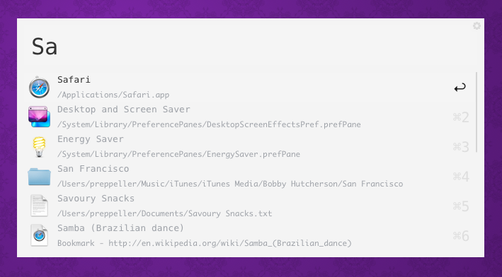

# Code theme for [Alfred](http://www.alfredapp.com/)

## Install

#### [Download](alfred://theme/searchForegroundColor=rgba(51,51,51,1.00)&resultSubtextFontSize=1&searchSelectionForegroundColor=rgba(0,0,0,1.00)&separatorColor=rgba(244,244,244,1.00)&resultSelectedBackgroundColor=rgba(245,245,245,1.00)&shortcutColor=rgba(222,222,222,1.00)&scrollbarColor=rgba(213,213,213,1.00)&imageStyle=4&resultSubtextFont=Monaco&background=rgba(244,244,244,1.00)&shortcutFontSize=3&searchFontSize=3&resultSubtextColor=rgba(160,163,168,1.00)&searchBackgroundColor=rgba(245,245,245,1.00)&name=Code&resultTextFontSize=1&resultSelectedSubtextColor=rgba(160,163,168,1.00)&shortcutSelectedColor=rgba(25,25,25,1.00)&widthSize=4&border=rgba(231,231,231,0.00)&resultTextFont=Menlo&resultTextColor=rgba(160,163,168,1.00)&cornerRoundness=2&searchFont=Menlo&searchPaddingSize=3&credits=Zander%20Martineau&searchSelectionBackgroundColor=rgba(181,213,255,1.00)&resultSelectedTextColor=rgba(51,51,51,1.00)&resultPaddingSize=4&shortcutFont=Menlo) the theme

## License

MIT
